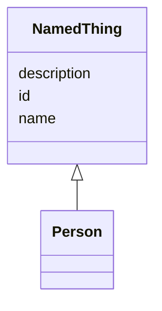

# Class: NamedThing
_A generic grouping for any identifiable entity_


URI: [schema:Thing](http://schema.org/Thing)





## Inheritance
* **NamedThing**
    * [Person](Person.md)


## Slots

| Name | Cardinality and Range  | Description  |
| ---  | ---  | --- |
| [id](id.md) | 1..1 <br/> [xsd:anyURI](xsd:anyURI)  | A unique identifier for a thing  |
| [name](name.md) | 0..1 <br/> [xsd:string](xsd:string)  | A human-readable name for a thing  |
| [description](description.md) | 0..1 <br/> [xsd:string](xsd:string)  | A human-readable description for a thing  |


## Usages


## Identifier and Mapping Information


### Schema Source


* from schema: https://w3id.org/turbomam/sheets-for-person-schema


## Mappings

| Mapping Type | Mapped Value |
| ---  | ---  |
| self | ['schema:Thing'] |
| native | ['sheets_for_person_schema:NamedThing'] |


## LinkML Specification

<!-- TODO: investigate https://stackoverflow.com/questions/37606292/how-to-create-tabbed-code-blocks-in-mkdocs-or-sphinx -->

### Direct

<details>
```yaml
name: NamedThing
description: A generic grouping for any identifiable entity
from_schema: https://w3id.org/turbomam/sheets-for-person-schema
rank: 1000
slots:
- id
- name
- description
class_uri: schema:Thing

```
</details>

### Induced

<details>
```yaml
name: NamedThing
description: A generic grouping for any identifiable entity
from_schema: https://w3id.org/turbomam/sheets-for-person-schema
rank: 1000
attributes:
  id:
    name: id
    description: A unique identifier for a thing
    from_schema: https://w3id.org/turbomam/sheets-for-person-schema
    rank: 1000
    slot_uri: schema:identifier
    identifier: true
    alias: id
    owner: NamedThing
    domain_of:
    - NamedThing
    range: uriorcurie
  name:
    name: name
    description: A human-readable name for a thing
    from_schema: https://w3id.org/turbomam/sheets-for-person-schema
    rank: 1000
    slot_uri: schema:name
    alias: name
    owner: NamedThing
    domain_of:
    - NamedThing
    range: string
  description:
    name: description
    description: A human-readable description for a thing
    from_schema: https://w3id.org/turbomam/sheets-for-person-schema
    rank: 1000
    slot_uri: schema:description
    alias: description
    owner: NamedThing
    domain_of:
    - NamedThing
    range: string
class_uri: schema:Thing

```
</details>