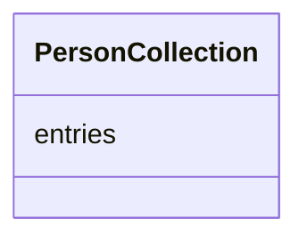

# Class: PersonCollection
_A holder for Person objects_


URI: [sheets_for_person_schema:PersonCollection](https://w3id.org/turbomam/sheets-for-person-schema/PersonCollection)





<!-- no inheritance hierarchy -->


## Slots

| Name | Cardinality and Range  | Description  |
| ---  | ---  | --- |
| [entries](entries.md) | 0..* <br/> [Person](Person.md)  |   |


## Usages


## Identifier and Mapping Information


### Schema Source


* from schema: https://w3id.org/turbomam/sheets-for-person-schema


## Mappings

| Mapping Type | Mapped Value |
| ---  | ---  |
| self | ['sheets_for_person_schema:PersonCollection'] |
| native | ['sheets_for_person_schema:PersonCollection'] |


## LinkML Specification

<!-- TODO: investigate https://stackoverflow.com/questions/37606292/how-to-create-tabbed-code-blocks-in-mkdocs-or-sphinx -->

### Direct

<details>
```yaml
name: PersonCollection
description: A holder for Person objects
from_schema: https://w3id.org/turbomam/sheets-for-person-schema
rank: 1000
attributes:
  entries:
    name: entries
    from_schema: https://w3id.org/turbomam/sheets-for-person-schema
    rank: 1000
    multivalued: true
    range: Person
    inlined: true
tree_root: true

```
</details>

### Induced

<details>
```yaml
name: PersonCollection
description: A holder for Person objects
from_schema: https://w3id.org/turbomam/sheets-for-person-schema
rank: 1000
attributes:
  entries:
    name: entries
    from_schema: https://w3id.org/turbomam/sheets-for-person-schema
    rank: 1000
    multivalued: true
    alias: entries
    owner: PersonCollection
    domain_of:
    - PersonCollection
    range: Person
    inlined: true
tree_root: true

```
</details>